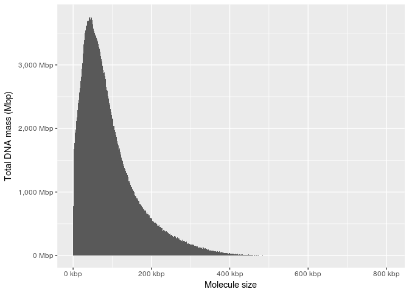

# Summary statistics of a Chromium library
Shaun Jackman  


# Calculate Lx and Nx statistics, like L50 and N50

```r
weighted_median_lx <- function(x, g = sum(as.numeric(x)), p = 0.5)
{
	tibble(x = x) %>% arrange(desc(x)) %>% mutate(i = seq_along(x), fraction = cumsum(as.numeric(x)) / g) %>% filter(fraction >= p) %$% i[[1]]
}

weighted_median_nx <- function(x, g = sum(as.numeric(x)), p = 0.5)
{
	tibble(x = x) %>% arrange(desc(x)) %$% x[[weighted_median_lx(x, g, p)]]
}
```

# Read data

```r
molecules_orig <- read_tsv(molecules_filename,
	col_types = cols(
	  Rname = col_character(),
	  Start = col_integer(),
	  End = col_integer(),
	  Size = col_integer(),
	  BX = col_character(),
	  MI = col_integer(),
	  Reads = col_integer(),
	  Mapq_median = col_integer(),
	  AS_median = col_integer(),
	  NM_median = col_integer()))
```

# Filter

```r
reads_threshold <- 4
as_median_threshold <- 100
nm_median_threshold <- 5
size_threshold <- 500

molecules <- molecules_orig %>%
	mutate(
		LogReadDensity = log10(Reads / ifelse(Size == 0, NA, Size)),
		Plastid = Rname == "KT634228") %>%
	filter(!is.na(BX),
		!Plastid,
		Reads >= reads_threshold,
		AS_median >= as_median_threshold,
		NM_median < nm_median_threshold,
		Size >= size_threshold)
```

# Count molecules and reads per barcode

```r
barcodes <- molecules %>%
	group_by(BX) %>%
	summarize(Molecules = n(), Reads = sum(Reads), Size = sum(Size)) %>%
	arrange(desc(Reads)) %>%
	ungroup()
```

# GEM Performance

```r
summary_table_barcodes <- tibble(
	"GEMs Detected" = nrow(barcodes),
	"N50 Linked-Reads per GEM" = weighted_median_nx(barcodes$Reads),
	"Median DNA per GEM" = median(barcodes$Size),
	"Mean DNA per GEM" = mean(barcodes$Size),
	"N50 DNA per GEM" = weighted_median_nx(barcodes$Size)
	) %>% gather("Metric", "Value")
summary_table_barcodes
```

|Metric                   |     Value|
|:------------------------|---------:|
|GEMs Detected            | 1717738.0|
|N50 Linked-Reads per GEM |     719.0|
|Median DNA per GEM       |  216295.5|
|Mean DNA per GEM         |  266988.6|
|N50 DNA per GEM          |  402223.0|

# Input DNA

```r
summary_table_molecules <- tibble(
	"Molecules Detected" = nrow(molecules),
	"N50 Linked-Reads per Molecule" = weighted_median_nx(molecules$Reads),
	"Median Molecule Length" = median(molecules$Size),
	"Mean Molecule Length" = mean(molecules$Size),
	"N50 Molecule Length" = weighted_median_nx(molecules$Size)
	) %>% gather("Metric", "Value")
summary_table_molecules
```

|Metric                        |       Value|
|:-----------------------------|-----------:|
|Molecules Detected            | 13207895.00|
|N50 Linked-Reads per Molecule |      134.00|
|Median Molecule Length        |    17900.00|
|Mean Molecule Length          |    34722.91|
|N50 Molecule Length           |    74265.00|

# Total DNA Mass

```r
ggplot(molecules) +
	aes(x = Size, weight = Size) +
	geom_histogram(binwidth = 1000, boundary = 0) +
	scale_x_continuous(name = "Molecule size", labels = unit_format(unit = "kbp", scale = 1e-3)) +
	scale_y_continuous(name = "Total DNA mass (Mbp)", labels = unit_format(unit = "Mbp", scale = 1e-6))
```

<!-- -->

# Write summary table to a TSV file

```r
rbind(summary_table_barcodes, summary_table_molecules) %>% write_tsv(output_tsv_filename)
```
